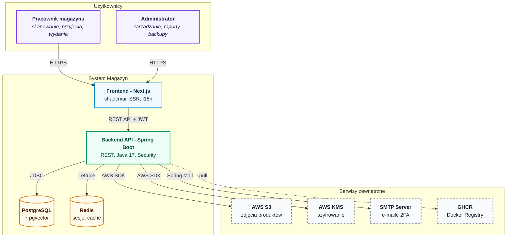
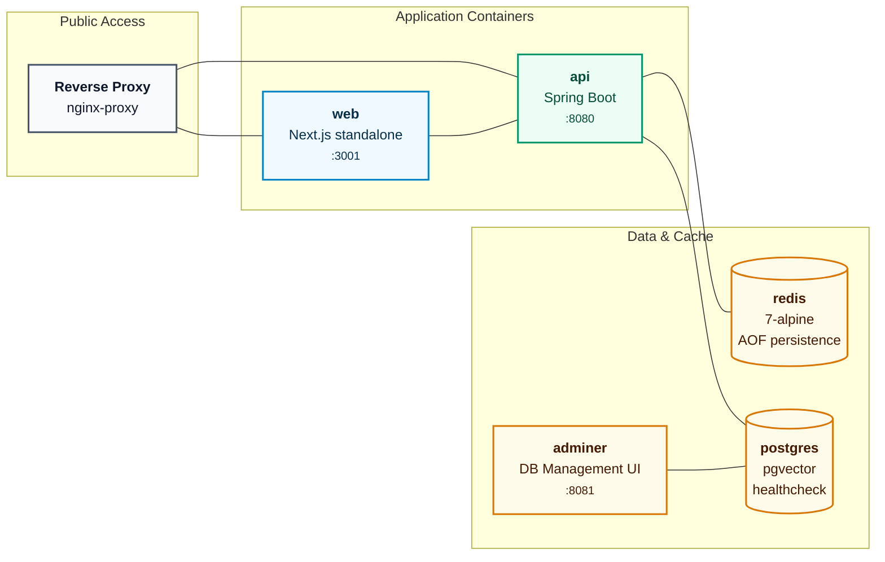
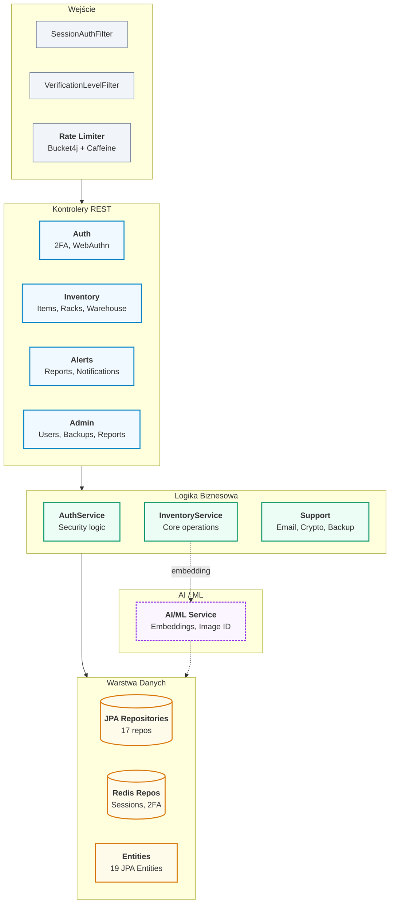
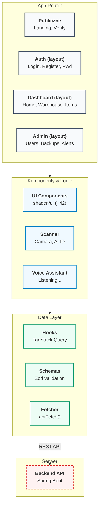
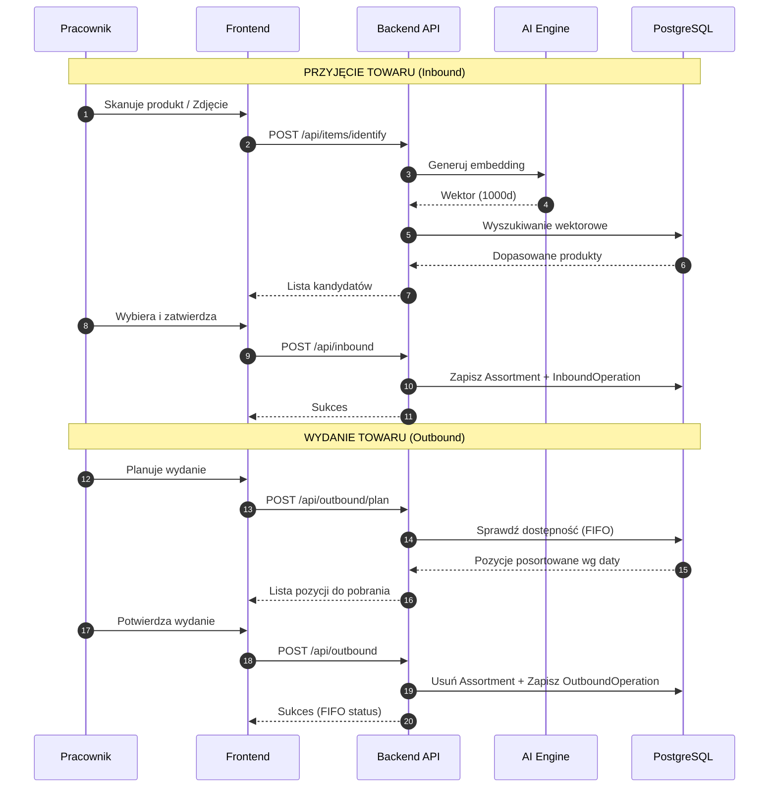
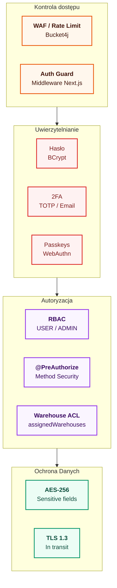
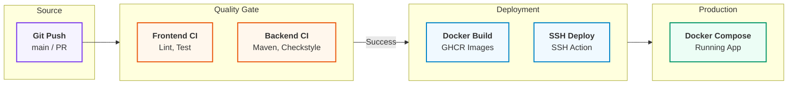
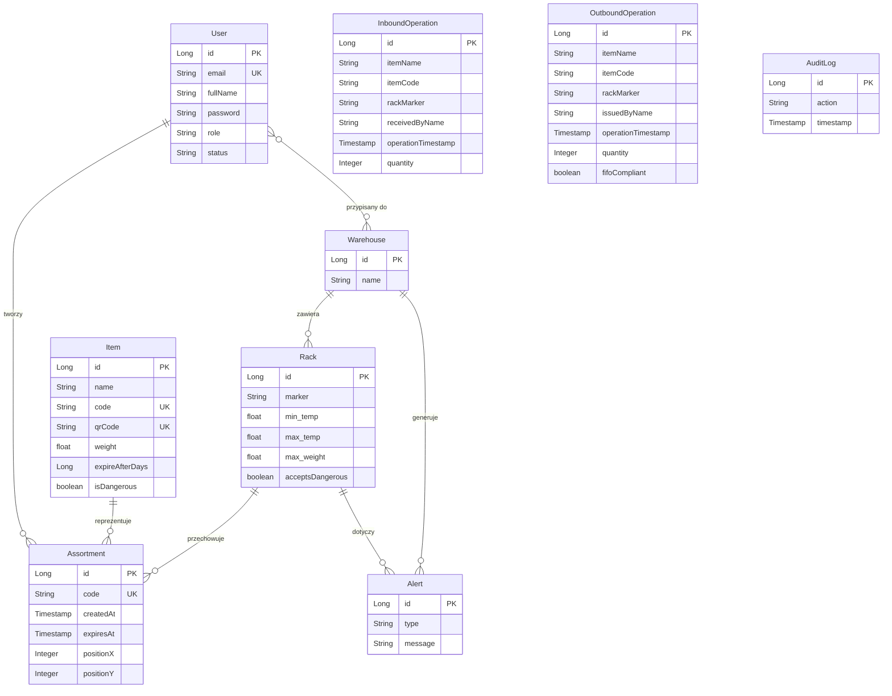

# Architektura systemu Magazyn

## Spis treści

1. [System Context (C4 Level 1)](#1-system-context)
2. [Container Diagram — Docker Compose](#2-container-diagram)
3. [Backend — Architektura warstwowa](#3-backend)
4. [Frontend — Struktura aplikacji](#4-frontend)
5. [Przepływ danych — Operacje magazynowe](#5-przepływ-danych)
6. [Architektura zabezpieczeń](#6-architektura-zabezpieczeń)
7. [CI/CD — Pipeline wdrożeniowy](#7-cicd)
8. [Model danych — Encje](#8-model-danych)

---

## 1. System Context

---

## 2. Container Diagram

---

## 3. Backend

---

## 4. Frontend

---

## 5. Przepływ danych

---

## 6. Architektura zabezpieczeń

## 7. CI/CD

---

## 8. Model danych

